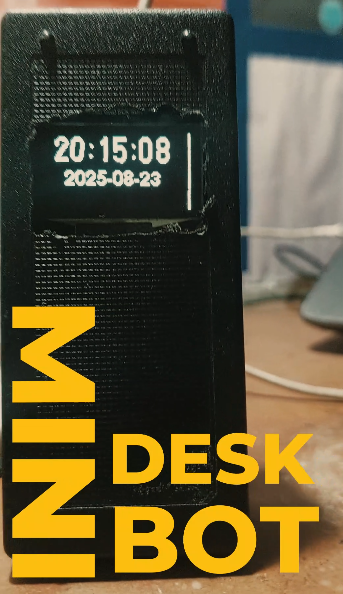
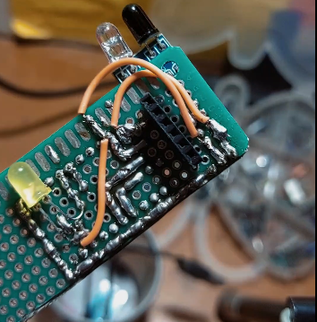
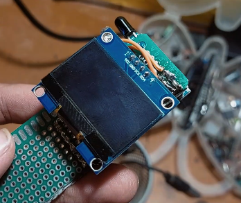
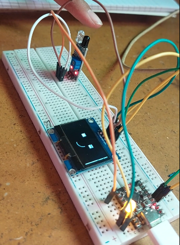
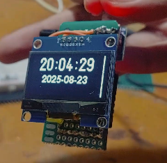

# 🤖 Mini Desk Bot  

A compact **desktop companion bot** built using the **ESP32-C3 Super Mini**!  
This cute little bot displays **real-time date and time**, reacts to **touch**, and changes its **facial expressions (emotions)** based on how long you interact with it.  
A perfect blend of creativity, electronics, and emotion-driven design — all on a tiny veroboard!

---

## 🧠 Project Description  

The **Mini Desk Bot** is a fun, interactive desktop robot designed to show how expressive embedded systems can be!  
It uses an **ESP32-C3 Super Mini** microcontroller paired with an **OLED display**, **LDR sensor**, **buzzer**, and **LEDs** to simulate a tiny emotional assistant.  

When you **touch** or **cover the sensor**, the bot changes its displayed **mood/emotion** — from normal to smile, to laugh, or annoyed 😠 — depending on how long you hold the touch.

---

## ✨ Features  

- 🕓 **Real-time clock** showing current date and time on a 0.96” OLED screen.  
- 🤗 **Touch-responsive emotions** — the bot reacts differently based on interaction duration.  
- 💡 **Ambient light sensing** using an LDR module to adjust brightness or trigger moods.  
- 🔊 **Buzzer feedback** for alerts or emotional expressions.  
- ⚙️ Built on **ESP32-C3 Super Mini**, combining power and simplicity.  
- 🔋 Compact, low-power, and perfect for your work desk or shelf.

---

## 🧩 Files Overview  

| File Name | Description |
|------------|-------------|
| **MINI_DESK_BOT.ino** | Main ESP32-C3 sketch controlling OLED display, buzzer, LDR, and emotions. |
| **circuit_backview.png** | Circuit diagram showing ESP32C3, OLED, buzzer, and LDR connections. |
| **screen_oled.png** | Example of OLED showing date and time. |
| **test_runs.png** | Screenshot of the bot’s test reaction cycles. |
| **time_date.png** | Sample of real-time clock display. |
| **MINI_Desk_bot.png** | Overall bot build on veroboard. |
| **Mini_Desktop_Bot.mp4** | Video demonstration of the Mini Desk Bot in action. |

---

## 🛠️ Hardware Used  

| Component | Description |
|------------|-------------|
| **ESP32-C3 Super Mini** | Main microcontroller (Wi-Fi & BLE enabled). |
| **OLED Display (0.96” I2C)** | For showing time, date, and expressions. |
| **LDR Sensor Module** | For light-based interaction or auto-dimming. |
| **Buzzer** | Used for emotional feedback sounds. |
| **LEDs** | Visual indicators of mood or response. |
| **Veroboard** | For compact and clean assembly. |
| **Touch Input** | Detects user interaction or “petting.” |
| **USB/5V Power Source** | Power for ESP32-C3 and peripherals. |

---

## ⚙️ Software Requirements  

- [Arduino IDE](https://www.arduino.cc/en/software)  
- **Board Package:** ESP32 by Espressif Systems (Install via Board Manager)  
- **Required Libraries:**
  - `Arduino.h`
  - `U8g2lib.h` — for OLED graphics
  - `WiFi.h` — for time sync via NTP
  - `time.h` — for real-time clock functionality  

---

## 🚀 How It Works  

1. **Startup:**  
   - The bot connects to Wi-Fi (for time synchronization).  
   - Displays the current date and time on the OLED.  

2. **Touch Interaction:**  
   - A short touch = smile or blink. 🙂  
   - A medium touch = surprised face 😮.  
   - A long touch = sleepy or annoyed emotion 😴😠.  
   - The buzzer and LEDs change tone/intensity accordingly.  

3. **Idle Mode:**  
   - Shows the current time with a calm expression.  
   - Adjusts brightness based on ambient light using the LDR.  

---

<!--## 🧭 Circuit Overview  

### 🖥️ OLED (I2C)  
- **SDA → GPIO6**  
- **SCL → GPIO7**

### 🔊 Buzzer  
- **Signal → GPIO4**

### 💡 LDR Sensor Module  
- **Analog Output → GPIO1 (ADC pin)**

### ⚡ Power  
- **VCC → 3.3V**  
- **GND → GND**

--->

## 🎥 Demonstration  

🎬 **Watch the Mini Desk Bot in Action:**  
[▶️ Mini_Desktop_Bot.mp4]([Mini_Desktop_Bot.mp4](https://github.com/im-Fatima/Mini_desk_bot/blob/main/Mini_Desktop_Bot.mp4))

---

## 🖼️ Images  

### 🧩 Complete Setup  

### 🔌 Circuit Back View  

### 🖥️ OLED Screen  

### 🧠 Test Run  

### ⏰ Time & Date Display  

---

## 💡 Future Improvements  

- 🎙️ Add **voice response** via microphone and speaker.  
- 🌐 Display **live weather or Wi-Fi info** on OLED.  
- 📱 Integrate with a **mobile app** for customization.  
- 💾 Store emotion stats using EEPROM or SPIFFS.  
- ⚡ Add **battery level monitoring** and auto-sleep mode.  
- 🧠 Implement **AI-based emotion adaptation** using light and touch patterns.  

---

## 📄 License  

This project is licensed under the **MIT License** — free to use, modify, and share with attribution.

